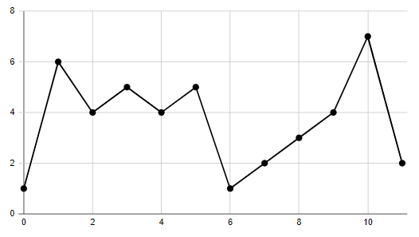
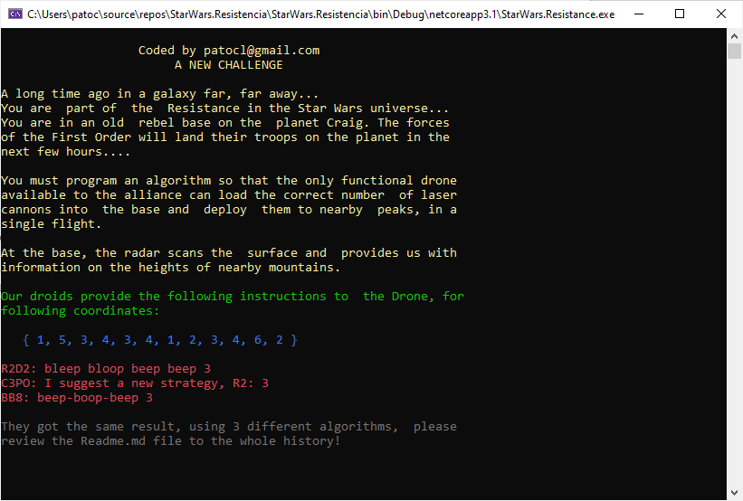

# Solución al reto de JSC Ingenium

## Problema

Formas parte de la Resistencia en el universo Star Wars. Te encuentras en una antigua base rebelde 
en el planeta Craig. Las fuerzas de la Primera Orden, van a desembarcar sus tropas en las próximas 
horas sobre el planeta. Debes programar un algoritmo para que, el único dron funcional del que dispone 
la alianza, pueda cargar en la base el número correcto de cañones laser y desplegarlos por las cumbres 
cercanas, en un único vuelo. 

En la base, el radar escanea la superficie y nos proporciona información de las alturas de las montañas cercanas. 
La información es un array A que contiene un número N de enteros. No pudiendo ser A nulo, ni N ser 0. 
Una cumbre C, es un elemento del array, el cual es más grande que sus dos vecinos. 

Más concretamente:
```csharp
 0 < C < N-1 y A[C-1] < A[C] > A[C + 1] 
```
Por ejemplo, para el siguiente array de elementos A: 
```csharp
A[0] = 1
A[1] = 6
A[2] = 4
A[3] = 5
A[4] = 4
A[5] = 5
A[6] = 1
A[7] = 2
A[8] = 3
A[9] = 4
A[10] = 7
A[11] = 2 
```
Encontramos 4 cumbres, que se corresponden con los índices 1, 3, 5 y 10 del array.

Vamos a planificar el vuelo de nuestro dron sobre las cumbres, las alturas relativas están representadas 
por el valor de la posición del array A, como se muestra en la siguiente figura. 



Tienes que elegir cuantos cañones laser necesita cargar el dron. El objetivo es establecer el número máximo 
de cañones en las cumbres, de acuerdo con ciertas reglas que nos plantea R2D2.

Los cañones solo se pueden poner en las cumbres. Si eliges un número K de cañones, entonces la distancia 
entre cualquiera de los cañones debería ser mayor o igual a K. La distancia entre los índices del array A, 
por ejemplo, P y Q es el valor absoluto P-Q. 

Por ejemplo, para nuestro array A con un valor N = 12, entonces: 
* Si eliges llevar 2 cañones, estas pueden colocarse en las cumbres 1 y 5 
* Si eliges llevar 3 cañones, estas pueden colocarse en las cumbres 1,5 y 10 
* Si eliges llevar 4 cañones, estas solo pueden colocarse en las cumbres 1,5 y 10. 

Es decir, para el ejemplo dado, solo puedes llevar 3 cañones. Debes programar el robot para cargar el dron, 
así que, escribe una función 

```csharp
class Solution{ 
    public int Solution(int[] A) {
        
    }
} 
```

Que dado un array no nulo y > 0 elementos, nos retorne el máximo número de cañones que pueden establecerse 
en las cumbres con las reglas establecidas anteriormente. 

Ejemplo, para el array:
```csharp
A[0] = 1
A[1] = 5
A[2] = 3
A[3] = 4
A[4] = 3
A[5] = 4
A[6] = 1
A[7] = 2
A[8] = 3
A[9] = 4
A[10] = 6
A[11] = 2 
```

La función debe retornar 3. 

>Escribe un algoritmo eficiente, asumiendo que N es un entero entre 1 y 400.000. 
>Cada elemento del array A, es un entero con valor de 0 a 1.000.000.000. 

## Implementación

He creado 3 algoritmos diferentes para realizar la tarea, a los que he creado en las clases
Solution1, Solution2, Solution3 con el método Solution(), los métodos son estáticos.

Ver la ejecucion del programa:



## Selección del mejor algoritmo

Después de implementarlos y validarles, debo seleccionar el más rápido, así que he creado un nuevo proyecto 
para evaluarlo usando la biblioteca .NET [BenchmarkDotNet](https://benchmarkdotnet.org/index.html) 
en [repositorio github](https://github.com/dotnet/BenchmarkDotNet)

### Algunos pasos para ejecutar el proyecto Benchmark

La solución debe compilarse en modo de Release

Prefiero ejecutarlo desde la línea de comando, abrir una terminal (CMD o Powershell) Ctrl + ~ en Visual Studio

Vaya a la carpeta de la solución de carpeta y ejecute los siguientes comandos

```powershell
dotnet build -c Release
```

Execute the Benchamark
```powershell
dotnet .\StarWars.Resistance.Benhmarks\bin\Release\netcoreapp3.1\StarWars.Resistance.Benchmarks.dll
```

¡Puede tomar unos minutos, la consola comenzará a mostrar el progreso del trabajo!
Cuando haya terminado, podrá revisar los resultados, tal vez simplemente desplácese un poco hacia arriba

De todos modos, configuré el proyecto Benchmark para generar Markdown en la carpeta Resultados.

### Resultados obtenidos en mi PC

|    Method | Categories |       Array |         Mean | Error | Ratio | Rank |  Gen 0 | Gen 1 | Gen 2 | Allocated |
|---------- |----------- |------------ |-------------:|------:|------:|-----:|-------:|------:|------:|----------:|
| **Solution1** |       **R2D2** | **Int32[1000]** | **17,427.64 ns** |    **NA** | **1.000** |    **8** | **0.9460** |     **-** |     **-** |    **4024 B** |
| Solution1 |       R2D2 |   Int32[12] |    355.08 ns |    NA | 0.020 |    6 | 0.0224 |     - |     - |      72 B |
| Solution1 |       R2D2 |    Int32[3] |    213.37 ns |    NA | 0.012 |    4 | 0.0150 |     - |     - |      40 B |
| **Solution2** |       **C3PO** | **Int32[1000]** | **19,354.99 ns** |    **NA** | **1.111** |    **9** | **1.1902** |     **-** |     **-** |    **5048 B** |
| Solution2 |       C3PO |   Int32[12] |    230.48 ns |    NA | 0.013 |    5 | 0.0267 |     - |     - |     112 B |
| Solution2 |       C3PO |    Int32[3] |     61.63 ns |    NA | 0.004 |    2 | 0.0172 |     - |     - |      72 B |
| **Solution3** |        **BB8** | **Int32[1000]** | **14,211.48 ns** |    **NA** | **0.815** |    **7** | **1.0223** |     **-** |     **-** |    **4304 B** |
| Solution3 |        BB8 |   Int32[12] |    143.45 ns |    NA | 0.008 |    3 | 0.0172 |     - |     - |      72 B |
| Solution3 |        BB8 |    Int32[3] |     36.75 ns |    NA | 0.002 |    1 | 0.0172 |     - |     - |      72 B |

Como podemos ver la solucion de solution3 de *BB8* es la mas rápida, para estar seguros he creado una bateria de datos de prueba aleatoria de 
400.000 valores, con el rango indicado anteriormente y los resultados son

|    Method |  Categories |     Mean | Error | Ratio | Rank |    Gen 0 |    Gen 1 |    Gen 2 | Allocated |
|---------- |------------ |---------:|------:|------:|-----:|---------:|---------:|---------:|----------:|
| Solution1 | R2D2-Random | 5.845 ms |    NA |  1.00 |    2 | 210.9375 | 210.9375 | 210.9375 |   1.53 MB |
| Solution2 | C3PO-Random | 8.435 ms |    NA |  1.44 |    3 | 437.5000 | 437.5000 | 437.5000 |   1.91 MB |
| Solution3 |  BB8-Random | 5.581 ms |    NA |  0.95 |    1 | 523.4375 | 492.1875 | 492.1875 |      2 MB |

## Conclusiones

Además de haber usado un codigo simple, generalmente uso el inglés para escribir código.
No estoy acostumbrado a escribir este tipo de algoritmos, pero imagino que si realmente se necesita velocidad
se poddría haber implementado multithread en algunas partes, me lo dejo para una *proxima tarea*

¡Realmente disfruté realizando este desafío!

**Encuéntrame en la web**

* Mi perfil en [Linkedin] (https://www.linkedin.com/in/patocl/?locale=en_US)
* Colaborando en [GitHub] (https://github.com/patocl)
* Aprendiendo sobre [Pluralsight] (https://app.pluralsight.com/profile/patocl)
***

